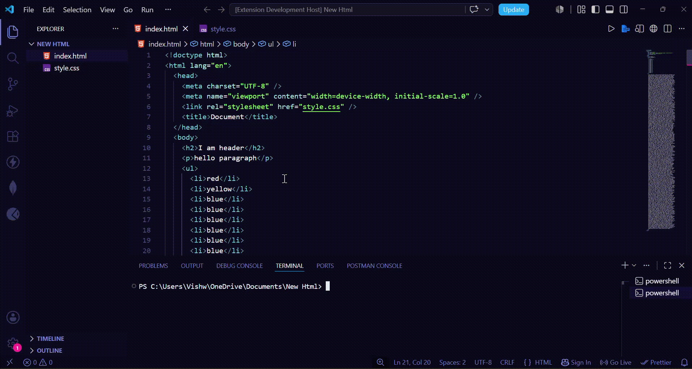

# Vish Live Server

## 🎥 Demos

### 🌐 Go Live

<p align="center">
  
</p>

### 👀 Live Preview

<p align="center">
  
</p>

---

Built entirely from scratch as a learning project to understand HTTP servers, WebSockets, file watching, child processes, promises, and the VS Code Extension API.

A lightweight **VS Code Live Server extension** built completely **from scratch using Node.js** without Express or any existing Live Server libraries.

This project was created to deeply understand how Live Server works internally—from building an HTTP server and serving static files to implementing WebSocket-based Live Reload, automatic port detection, and integrating everything into a VS Code extension.

---

# ✨ Features

- ⚡ Start a local development server with one click
- 🌐 Open your project directly in your default browser
- 👀 Live Preview inside VS Code
- 🔄 Live Reload using WebSockets
- 🔍 Automatic Port Detection when the default port is already in use
- 📄 Automatic HTML Live Reload script injection
- 🖱️ Right-click any HTML file → **Go Live**
- 👀 Right-click any HTML file → **Vish Live Preview**
- 📌 Status Bar integration (Go Live / Stop Live)
- 🛑 Stop Live Server directly from VS Code
- 📂 Serves the current workspace
- 📁 Supports nested HTML files
- 📺 HTTP Range Request support (video/audio streaming)
- 🔒 Prevents Directory Traversal attacks
- 🚀 Built completely without Express

---

# 📦 Installation

Install the extension directly from the **Visual Studio Code Marketplace**.

Or install manually:

1. Download the `.vsix` file.
2. Open VS Code.
3. Press **Ctrl + Shift + P**.
4. Select **Extensions: Install from VSIX...**
5. Choose the downloaded `.vsix` file.

---

# 🚀 Usage

## 🌐 Go Live (External Browser)

Launch your project directly in your default browser.

### Method 1

- Click **Go Live** from the Status Bar.

### Method 2

- Right-click any HTML file.
- Select **Go Live**.

Your browser will automatically open using the built-in Live Server.

---

## 👀 Live Preview (Inside VS Code)

Preview your website without leaving VS Code.

- Right-click any HTML file.
- Select **Vish Live Preview**.

The page opens inside a VS Code WebView while using the same Live Server instance.

---

## 🛑 Stop Live Server

Click **Stop Live** from the Status Bar to stop the running server.

---

# 🏗️ Built From Scratch

Unlike many simple Live Server clones, this project implements every major component manually.

## HTTP Server

- Native Node.js HTTP module
- Static file serving
- MIME type detection
- Stream-based file serving

## Live Reload

- WebSocket Server
- Automatic HTML injection
- Browser auto reload
- File watching using `fs.watch()`

## Performance

- Stream-based file serving
- HTTP Range Requests
- Automatic Port Detection
- Efficient handling of large files

## Security

- Directory Traversal protection
- Safe path resolution
- Restricted access outside the workspace

## VS Code Extension

- Status Bar integration
- Explorer Context Menu
- Live Preview (WebView)
- External Browser Launch
- Child Process management
- Promise-based server startup synchronization
- Automatic Port Detection
- Server lifecycle management

---

# 📂 Project Structure

```text
.
├── extension.js
├── server.js
├── live-reload.js
├── package.json
├── images/
│   ├── go-live-demo.gif
│   ├── live-preview-demo.gif
│   └── icon.png
├── README.md
├── CHANGELOG.md
└── LICENSE
```

---

# 🛠️ Technologies Used

- Node.js
- JavaScript
- VS Code Extension API
- HTTP
- WebSocket (`ws`)
- Child Process API
- File System (`fs`)
- Promises
- Streams

---

# 📌 Current Features

- ✅ HTTP Server
- ✅ Static File Serving
- ✅ Live Reload
- ✅ Live Preview (VS Code WebView)
- ✅ External Browser Launch
- ✅ Automatic Port Detection
- ✅ WebSocket Integration
- ✅ Automatic HTML Injection
- ✅ Status Bar Integration
- ✅ Explorer Context Menu
- ✅ Promise-based Server Startup
- ✅ Child Process Management
- ✅ Stop Live Server
- ✅ HTTP Range Requests
- ✅ MIME Type Detection
- ✅ Directory Traversal Protection

---

# 🚧 Roadmap

- [ ] Custom Port Settings
- [ ] Live Preview Address Bar
- [ ] Preview Navigation Controls
- [ ] Custom Browser Support
- [ ] Better Error Handling
- [ ] Multiple Workspace Support
- [ ] File Ignore Patterns
- [ ] Extension Settings
- [ ] Automatic Browser Refresh Toggle
- [ ] Marketplace Improvements

---

# 🤝 Contributing

Contributions, issues, and feature requests are welcome.

Feel free to open an issue or submit a pull request if you'd like to improve the project.

---

# 📄 License

This project is licensed under the **MIT License**.

---

# 👨‍💻 Author

**Vishwajeet Bera**

GitHub:  
https://github.com/Vishwajeet81

If you found this project useful, consider giving it a ⭐ on GitHub!